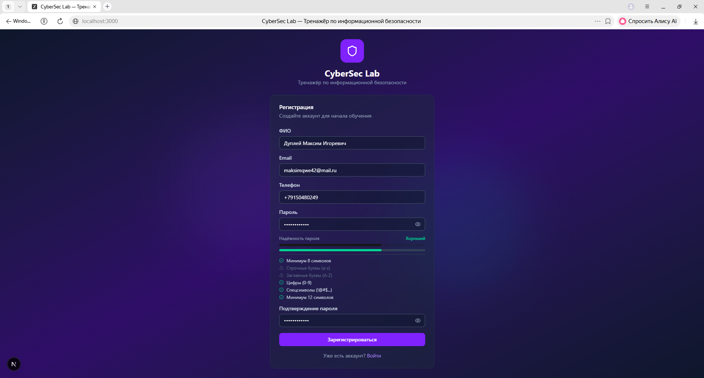
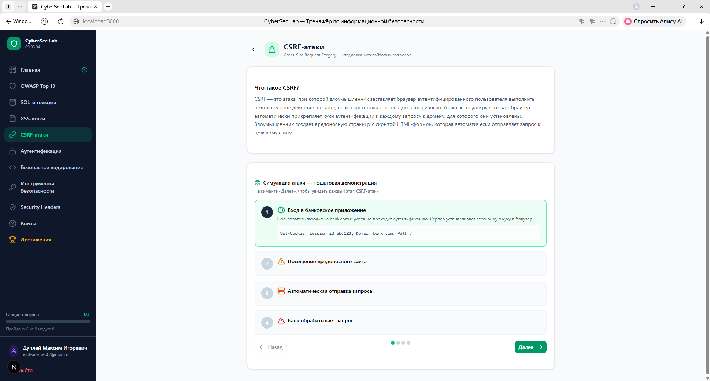
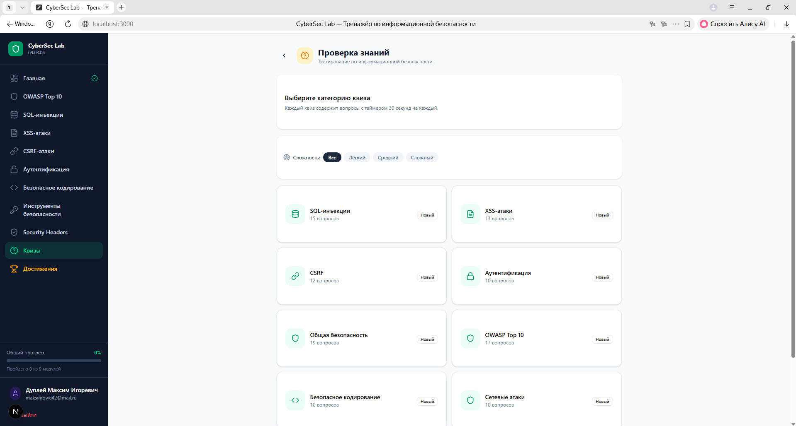
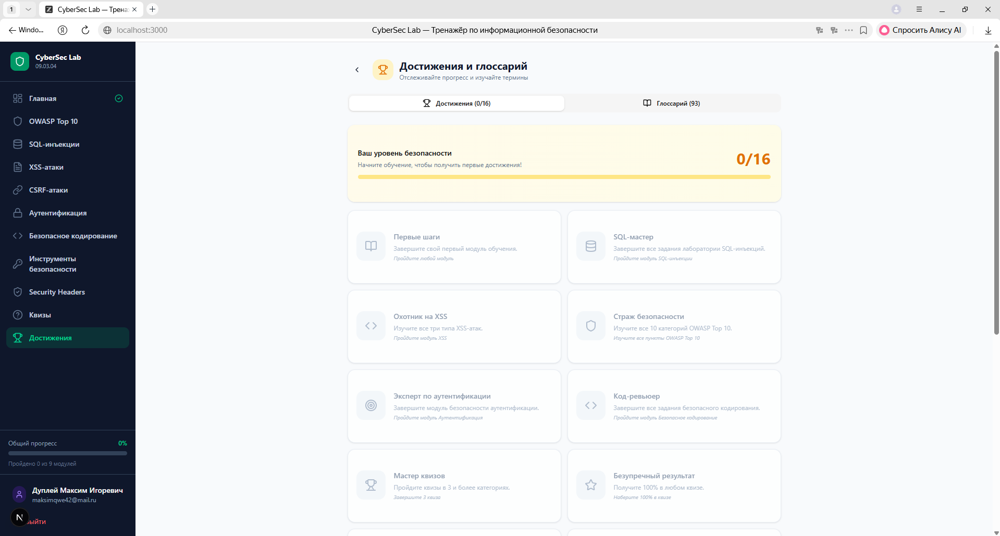
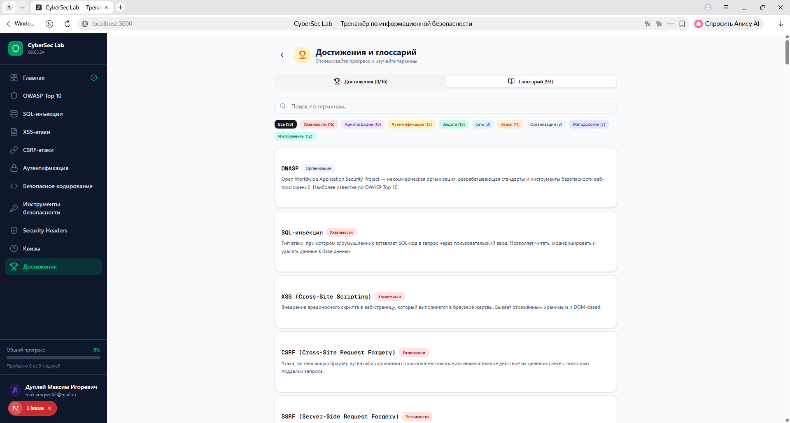

<div align="center">

# CyberSec Lab — Интерактивный тренажёр по информационной безопасности

### Интерактивная платформа для обучения основам информационной безопасности

[](https://nextjs.org/)
[](https://www.typescriptlang.org/)
[](https://react.dev/)
[](https://tailwindcss.com/)
[](https://ui.shadcn.com/)
[](./LICENSE)

---

**Автор:** Дуплей Максим Игоревич

**Интеллектуальная собственность:** Дуплей Максим Игоревич

</div>

---

## О проекте

**CyberSec Lab** — это комплексная веб-платформа для интерактивного изучения основ информационной безопасности, веб-безопасности и безопасной разработки. Проект разработан как полноценное образовательное приложение, объединяющее 8 обучающих модулей, систему тестирования с таймером (**136 вопросов** по 9 категориям с фильтрацией по сложности), лабораторные работы по SQL-инъекциям, XSS, CSRF, ревью кода, криптографические инструменты, систему достижений (**16 достижений**) и глоссарий из **93 терминов**. Платформа предназначена для студентов направления «Программная инженерия» (09.03.04), преподавателей и всех, кто хочет изучить актуальные угрозы и методы защиты на практике.

Все материалы представлены на русском языке и опираются на актуальные стандарты безопасности, включая OWASP Top 10 (2021), NIST Incident Response, CVSS v3.1 и OWASP API Security Top 10.

## Ключевые возможности

- **8 интерактивных модулей** — от OWASP Top 10 до Security Headers, каждый модуль включает теорию, примеры кода и практические задания
- **136 вопросов квиза** по 9 категориям с таймером, подробными пояснениями и фильтрацией по сложности
- **16 лабораторных заданий** по SQL-инъекциям: от обхода аутентификации до WAF Bypass, NoSQL Injection, Out-of-band и Polyglot-атак
- **9 типов XSS** с интерактивной демонстрацией атак и санитизации (Отражённый, Хранимый, DOM, SVG, Markdown, PDF, Angular, Template Literal, Web Storage)
- **35 задач по ревью кода**: найдите уязвимость (SQLi, XSS, IDOR, SSRF, XXE, SSTI, Prototype Pollution, LDAP Injection, Mass Assignment, Prompt Injection, CORS Misconfiguration, File Upload) и выберите правильное решение
- **Криптографические инструменты**: шифры Цезаря, Виженера, XOR, ROT13; кодирование Base64/URL; хеш-функции; генератор паролей; AES-GCM демо; JWT decoder
- **12 HTTP-заголовков безопасности** с интерактивными квизами по каждому заголовку
- **16 достижений** — от первых шагов до мастерства, мотивирующие бейджи за прогресс
- **Система отслеживания прогресса** — сохранение в localStorage, статистика по модулям и квизам
- **Глоссарий из 93 терминов** с поиском и фильтрацией по 9 категориям
- **Адаптивный интерфейс** — полностью отзывчивый дизайн для мобильных устройств, планшетов и десктопов
- **Анимации и переходы** — плавный интерфейс на базе Framer Motion

## Скриншоты платформы

<div align="center">

| | | |
|-|-|-|
|  |  |  |
|  |  |  |
|  |  |  |
|  |  |  |
|  |  | |

</div>

## Модули платформы

| # | Модуль | Категория | Описание |
|---|--------|-----------|----------|
| 1 | **OWASP Top 10** | Веб-безопасность | 10 категорий уязвимостей (Broken Access Control, Cryptographic Failures, Injection, Insecure Design, Security Misconfiguration, Vulnerable Components, Auth Failures, Data Integrity, Logging, SSRF) с примерами уязвимого и безопасного кода, реальными кейсами и способами защиты |
| 2 | **SQL-инъекции** | Атака-защита | 11 интерактивных заданий от простого обхода аутентификации до WAF Bypass, Out-of-band и Polyglot-атак с визуализацией SQL-запросов |
| 3 | **XSS-атаки** | Атака-защита | 6 типов XSS: отражённый, хранимый, DOM-based, SVG, Markdown и PDF. Интерактивные демонстрации атак с переключением между уязвимым и безопасным режимом |
| 4 | **CSRF-атаки** | Атака-защита | Визуальная симуляция CSRF-атаки с пошаговой демонстрацией, SameSite cookie и механизмами защиты |
| 5 | **Аутентификация** | Безопасность | Тренажёры: проверка надёжности пароля, визуализация брутфорса, демо bcrypt-хеширования, интерактивный TOTP/2FA, разбор JWT-сессий |
| 6 | **Безопасное кодирование** | Ревью кода | 25 задач по ревью кода: найдите уязвимость и выберите правильное решение. SQLi, XSS, IDOR, SSRF, XXE, SSTI, Prototype Pollution, LDAP Injection, Mass Assignment и др. |
| 7 | **Security Headers** | Инфраструктура | 6 HTTP-заголовков безопасности: CSP, HSTS, X-Frame-Options, X-Content-Type-Options, Referrer-Policy, Permissions-Policy. Пошаговое обучение с квизом |
| 8 | **Инструменты безопасности** | Криптография | Шифры (Цезарь, Виженер, XOR), кодирование (Base64, URL), хеш-функции (MD5, SHA-1, SHA-256) и генератор паролей |

## Система тестирования

- **110+ вопросов** по 9 категориям:

| Категория | Кол-во | Темы |
|-----------|--------|------|
| SQL-инъекции | 15 | Parameterized queries, UNION, Blind SQLi, Second-order, WAF Bypass, Stacked queries |
| XSS-атаки | 13 | DOM-based, CSP bypass, mXSS, WebSocket XSS, SVG XSS, Filter evasion |
| CSRF | 12 | SameSite, Double Submit Cookie, JSON endpoints, REST API, Token predictability |
| Аутентификация | 10 | OAuth, Session Fixation, Credential Stuffing, Password reset tokens, MFA Fatigue |
| Общая безопасность | 19 | Zero-day lifecycle, CVSS, Defense in Depth, Incident Response, Pentesting, MITM, Supply Chain |
| OWASP Top 10 | 17 | IDOR, BOLA, SSRF, DNS Rebinding, Serverless, Container/K8s, Mobile (MASVS), AI/ML security |
| Безопасное кодирование | 10 | DOMPurify, Allowlist, Timing Attack, LDAP Injection, SSTI, JWT, Prototype Pollution, Email injection, GraphQL |
| **Сетевые атаки** | 10 | ARP Spoofing, DNS Amplification, Nmap, VLAN Hopping, Evil Twin, ICMP Flood, BGP Hijacking, KRACK, DNS Poisoning |
| **Социальная инженерия** | 10 | Spear Phishing, Pretexting, Tailgating, Vishing, Smishing, Watering Hole, Baiting, Clone Phishing, CEO Fraud |

- Фильтрация по сложности (лёгкий / средний / сложный)
- Таймер на 30 секунд на вопрос
- Система оценки с разбивкой по темам и уровням сложности
- Подробный разбор ответов после завершения

## Система достижений и геймификация

- **16 достижений** с условиями разблокировки — от первых шагов до полного прохождения
- Отслеживание прогресса в реальном времени
- Статистика по каждому модулю и квизу
- Глоссарий из **80+ терминов** с поиском и фильтрацией по 9 категориям

## Технологии

| Технология | Версия | Назначение |
|------------|--------|------------|
| **Next.js** | 15 | React-фреймворк с App Router и SSR |
| **TypeScript** | 5 | Статическая типизация для надёжности кода |
| **React** | 19 | Библиотека пользовательского интерфейса |
| **Tailwind CSS** | 4 | Утилитарные CSS-стили для быстрой разработки UI |
| **shadcn/ui** | — | Компоненты интерфейса в стиле New York |
| **Zustand** | 5 | Лёгкое управление состоянием с персистентностью в localStorage |
| **Framer Motion** | 12 | Плавные анимации и переходы |
| **React Syntax Highlighter** | — | Подсветка синтаксиса в блоках кода |
| **Lucide React** | — | Набор иконок для интерфейса |
| **Radix UI** | — | Примитивы доступных UI-компонентов |

## Установка и запуск

### Предварительные требования

- **Node.js** версии 18.17 или выше (рекомендуется 20+)
- **npm**, **yarn**, **pnpm** или **bun** в качестве пакетного менеджера

### Установка

```bash
# Клонировать репозиторий
git clone https://github.com/QuadDarv1ne/cybersec-lab-trainer.git
cd cybersec-lab-trainer

# Установить зависимости
npm install

# Настроить базу данных (PostgreSQL)
# Вариант 1: Использовать Docker (рекомендуется)
docker compose up -d postgres

# Вариант 2: Использовать облачный PostgreSQL (Neon, Supabase)
# Скопировать .env.example в .env.local и указать DATABASE_URL

# Применить миграции
npm run db:migrate

# Запустить в режиме разработки
npm run dev
```

Приложение будет доступно по адресу [http://localhost:3000](http://localhost:3000)

### Сборка для продакшена

```bash
# Сборка проекта
npm run build

# Запуск собранного приложения
npm start
```

## Структура проекта

```
cybersec-lab-trainer/
├── public/                         # Статические файлы
│   ├── security-logo.png           # Логотип проекта
│   └── robots.txt
├── src/
│   ├── app/
│   │   ├── layout.tsx              # Корневой layout
│   │   ├── page.tsx                # Главная страница (SPA)
│   │   ├── globals.css             # Глобальные стили
│   │   └── api/
│   │       └── route.ts            # API-маршруты
│   ├── components/
│   │   ├── security-trainer/       # Модули тренажёра
│   │   │   ├── Sidebar.tsx         # Навигационная боковая панель
│   │   │   ├── Dashboard.tsx       # Главная панель с обзором модулей
│   │   │   ├── OWASPTop10.tsx      # Модуль OWASP Top 10
│   │   │   ├── SQLInjectionLab.tsx # Лаборатория SQL-инъекций
│   │   │   ├── XSSLab.tsx          # Лаборатория XSS-атак
│   │   │   ├── CSRFLab.tsx         # Лаборатория CSRF
│   │   │   ├── SecurityHeadersLab.tsx # Лаборатория Security Headers
│   │   │   ├── AuthSecurityLab.tsx # Безопасность аутентификации
│   │   │   ├── SecureCodingLab.tsx # Задачи на безопасное кодирование
│   │   │   ├── ToolsLab.tsx        # Криптографические инструменты
│   │   │   ├── AchievementsGlossary.tsx # Достижения и глоссарий
│   │   │   ├── QuizSystem.tsx      # Система тестирования с таймером
│   │   │   ├── AuthPages.tsx       # Страницы регистрации/входа
│   │   │   ├── ProfilePage.tsx     # Страница профиля пользователя
│   │   │   ├── OTPModal.tsx        # Модальное окно OTP-верификации
│   │   │   └── CodeBlock.tsx       # Компонент подсветки кода
│   │   └── ui/                     # shadcn/ui компоненты
│   ├── lib/
│   │   ├── security-data.ts        # Учебные данные (OWASP, SQL, XSS, квизы, задачи)
│   │   ├── store.ts                # Zustand store с localStorage
│   │   ├── auth-store.ts           # Store аутентификации
│   │   ├── auth-utils.ts           # Утилиты аутентификации
│   │   └── utils.ts                # Общие утилиты
│   └── hooks/                      # Пользовательские хуки
├── prisma/
│   └── schema.prisma               # Схема базы данных
├── package.json                    # Зависимости и скрипты
├── next.config.ts                  # Конфигурация Next.js
├── tsconfig.json                   # Конфигурация TypeScript
├── tailwind.config.ts              # Конфигурация Tailwind CSS
├── README.md                       # Краткая документация (RU)
├── README_RU.md                    # Полная документация на русском
├── README_EN.md                    # Full documentation in English
├── LICENSE                         # Лицензия
└── .gitignore                      # Исключения Git
```

## Дорожная карта

- [x] Модуль OWASP Top 10 — 10 категорий с примерами кода
- [x] Лаборатория SQL-инъекций — 11 заданий от новичка до эксперта
- [x] Лаборатория XSS-атак — 6 типов XSS
- [x] Симуляция CSRF-атак
- [x] Модуль аутентификации — пароли, брутфорс, bcrypt, TOTP/2FA, JWT
- [x] Безопасное кодирование — 25 задач по ревью кода
- [x] Security Headers — 6 заголовков безопасности
- [x] Криптографические инструменты
- [x] Система тестирования — 110+ вопросов, таймер, фильтрация
- [x] Система достижений и глоссарий
- [x] Аутентификация с OTP-верификацией и профилями пользователей
- [x] PWA-манифест и офлайн-работа
- [x] E2E-тесты (Playwright)
- [ ] Интеграция с LMS (Moodle)

---

## Автор

**Дуплей Максим Игоревич**

Данный проект является интеллектуальной собственностью Дуплей Максима Игоревича. Все права на программный код, дизайн, контент и учебные материалы принадлежат автору.

---

## Лицензия

Данный проект является интеллектуальной собственностью Дуплей Максима Игоревича. Условия использования описаны в файле [LICENSE](./LICENSE).

---

<div align="center">

**CyberSec Lab** — © 2025-2026 Дуплей Максим Игоревич

</div>
